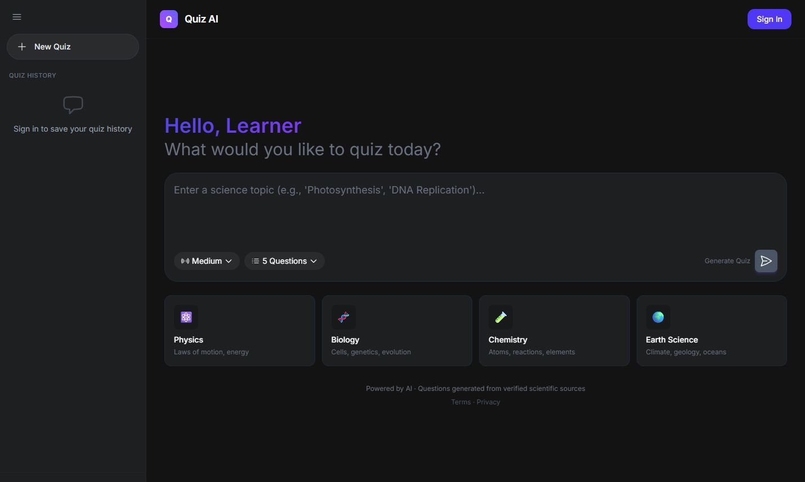
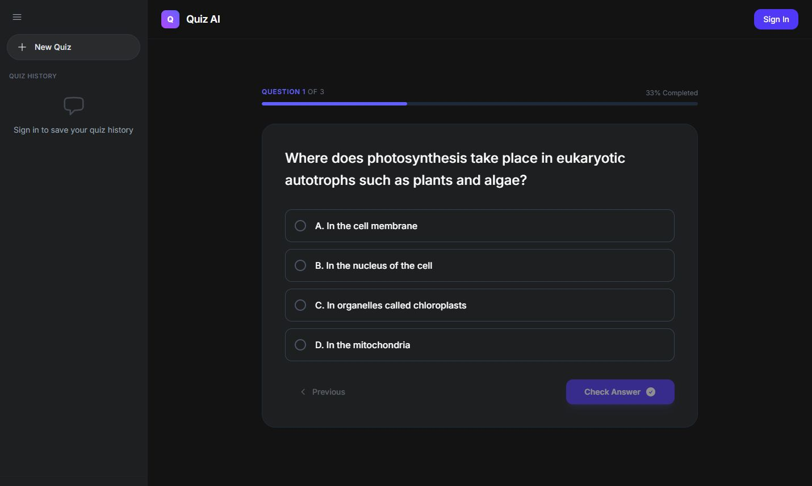
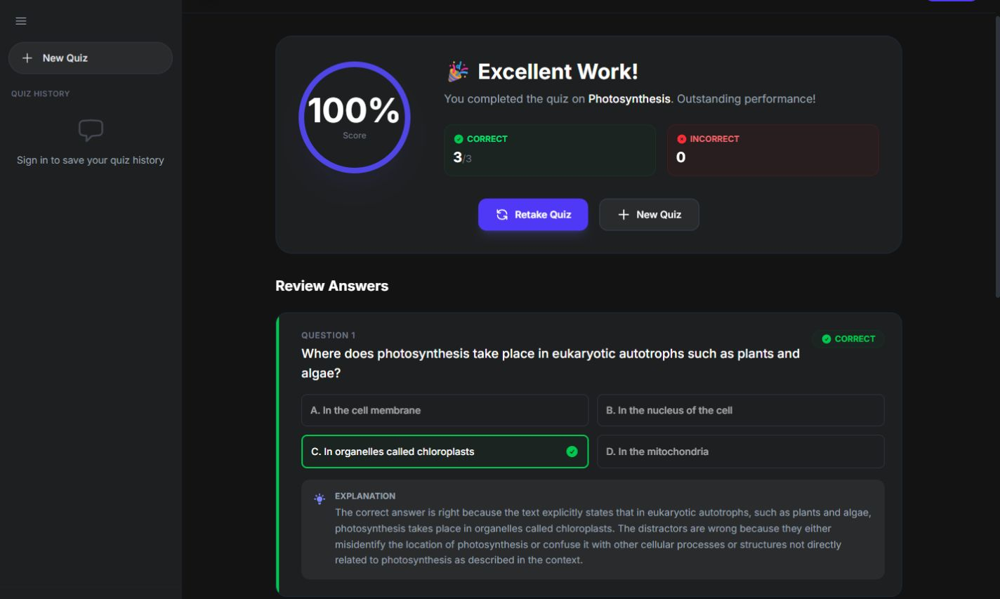

# Quiz AI

Fen bilimleri için kaynaklara dayalı çoktan seçmeli sorular hazırlayan yapay zekâ destekli eğitim uygulaması.

Fen bilimleri konularında çoktan seçmeli sorular üreten bir mezuniyet projesi. Kullanıcı konu ve zorluk düzeyini seçer; uygulama ilgili içerikleri SciQ veri kümesinden oluşturulmuş FAISS indeksinde arar ve Groq üzerinden çalışan dil modeliyle soru üretir. Sorular, açıklamalar ve sonuçlar uygulamada görüntülenir; geçmiş ve ilerleme kaydedilir.

## Ekran görüntüleri

| Ana sayfa | Soru | Sonuçlar |
| --- | --- | --- |
|  |  |  |

## Özellikler

- Konu ve zorluk düzeyine göre çoktan seçmeli soru oluşturma
- SciQ verisi üzerinde FAISS ile kaynak bulma
- Konu dışı istekleri ayırma ve benzer istekler için semantik önbellek
- E-posta/parola ile giriş; isteğe bağlı Google girişi
- Sınav geçmişi, puanlar, ilerleme ve açıklamalar
- Üretilen soruları karşılaştırmak için ayrı değerlendirme betikleri

## Kullanılan teknolojiler

- **Arayüz:** Next.js 16, React 19, TypeScript, Tailwind CSS
- **API ve veri:** FastAPI, Pydantic, SQLite
- **Soru üretimi:** Groq, Sentence Transformers, FAISS, SciQ
- **Değerlendirme:** pandas, scikit-learn, SciPy, Matplotlib, Seaborn

Akış kabaca şöyledir: **Next.js → FastAPI → konu dışı istek kontrolü → semantik önbellek → FAISS araması → soru üretimi → çıktı doğrulama**. Uygulama kodu `backend/app` ve `frontend/src` içindedir; deney ve değerlendirme çalışmaları `tez/evaluation` altında yer alır.

## Yerel kurulum

Python 3.11 veya üzeri ve Node.js gerekir. API anahtarı için Groq hesabı gereklidir.

### Backend

```bash
python -m venv .venv
source .venv/bin/activate
pip install -r requirements.txt
cp .env.example .env
uvicorn backend.app.main:app --reload
```

Windows'ta sanal ortamı `.venv\Scripts\activate` ile açın ve `cp` yerine `copy` kullanın. `.env` içine `GROQ_API_KEY` girin; geliştirme dışındaki ortamlarda farklı bir `JWT_SECRET_KEY` belirleyin. Google girişini kullanacaksanız OAuth değişkenlerini de doldurun. API: `http://localhost:8000`.

### Frontend

Ayrı bir terminalde:

```bash
cd frontend
npm install
cp .env.example .env.local
npm run dev
```

Windows'ta yine `copy` kullanın. Uygulama: `http://localhost:3000`.

## Veri ve testler

FAISS indeksi ve işlenmiş veriler repository'de bulunur. Baştan üretmek için kök dizinden sırayla `python backend/scripts/load_dataset.py`, `python backend/scripts/chunking.py` ve `python backend/scripts/build_index.py` çalıştırılabilir.

```bash
python -m unittest discover -s backend/tests -v
python tez/evaluation/scripts/run_full_experiment.py
```

Frontend için `frontend` dizininde `npm run lint` ve `npm run build` çalıştırın. Değerlendirme çıktıları `tez/evaluation/results/reports` altına yazılır.

**Durum:** Bu proje yerel olarak çalıştırılabilen akademik/portföy çalışmasıdır. Üretilen sorular hatalı olabilir; önemli kararlar için ayrıca doğrulanmalıdır. API anahtarlarını ve yerel veritabanlarını Git'e eklemeyin.

## Lisans

[MIT](LICENSE).
